# 🍔 Wolt - Food Delivery App

A modern, feature-rich food delivery application built with React Native and Expo, inspired by Wolt. Browse restaurants, explore menus, manage your cart, and place orders seamlessly.


## 📱 Screenshots

<div align="center">
  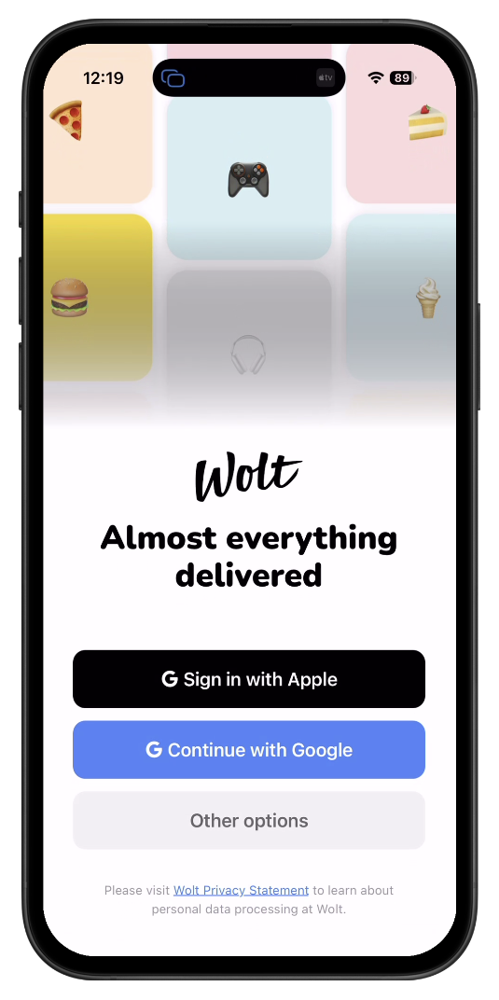
  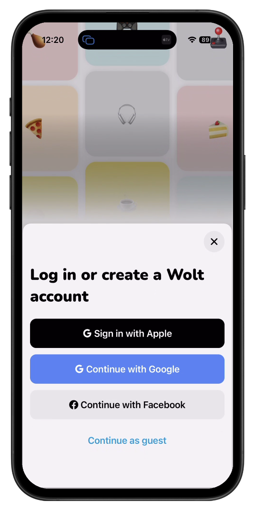
  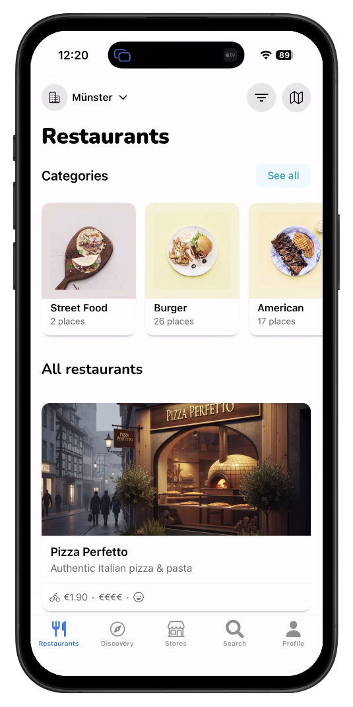
  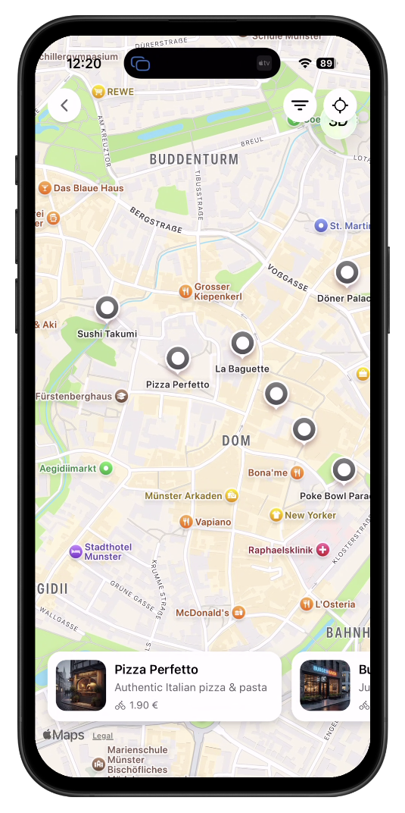
</div>

<div align="center">
  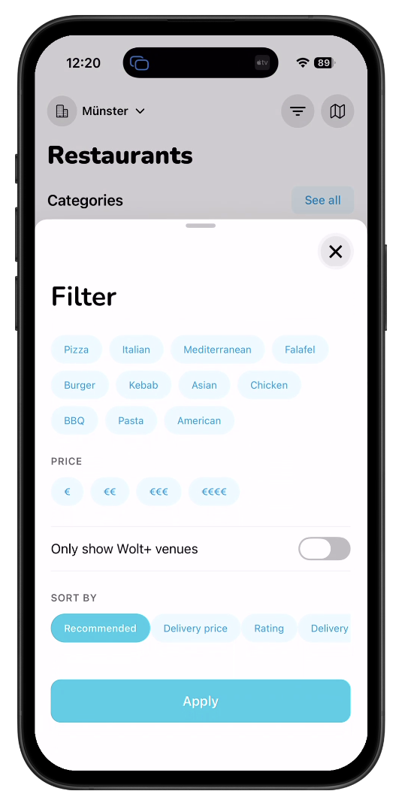
  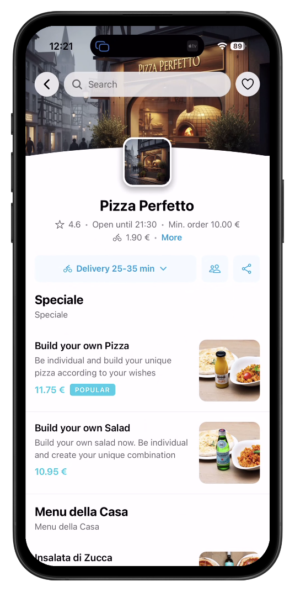
  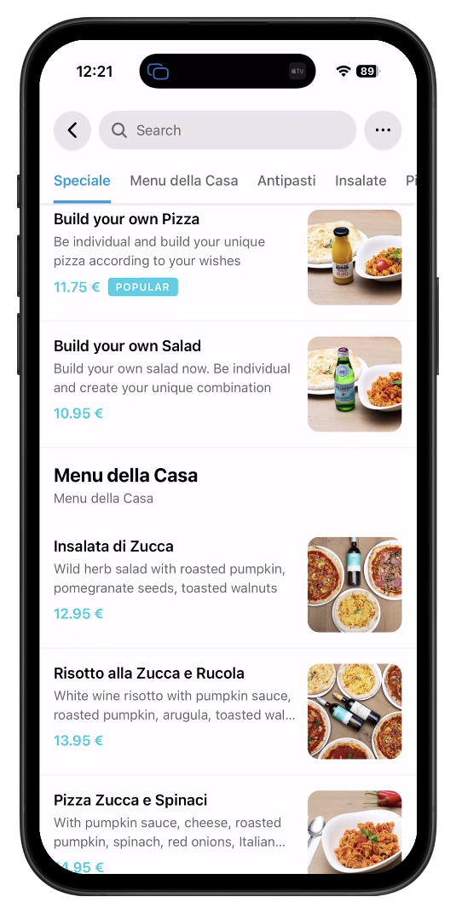
  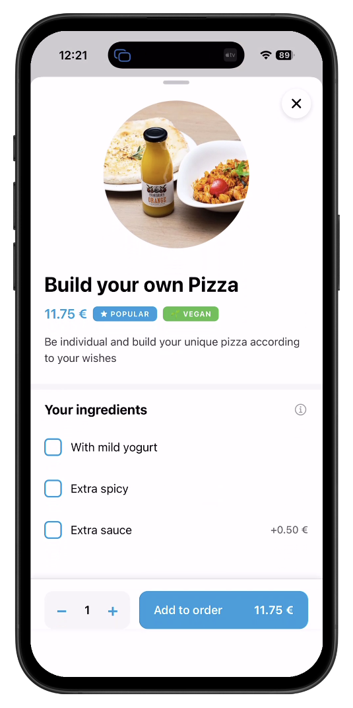
</div>

<div align="center">
  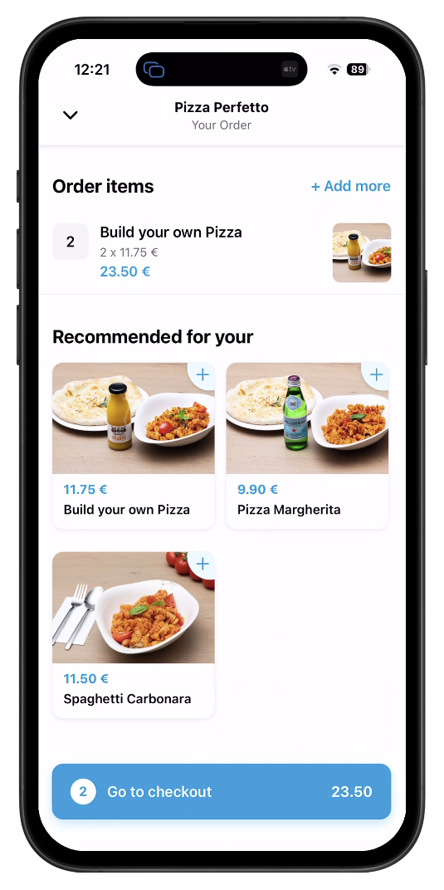
  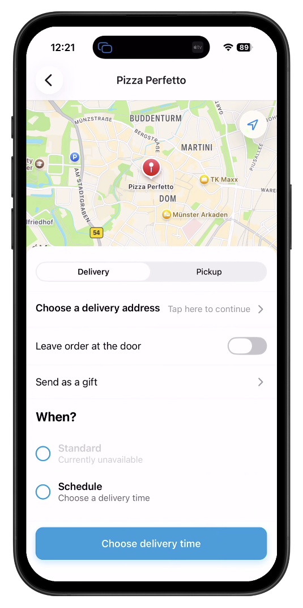
  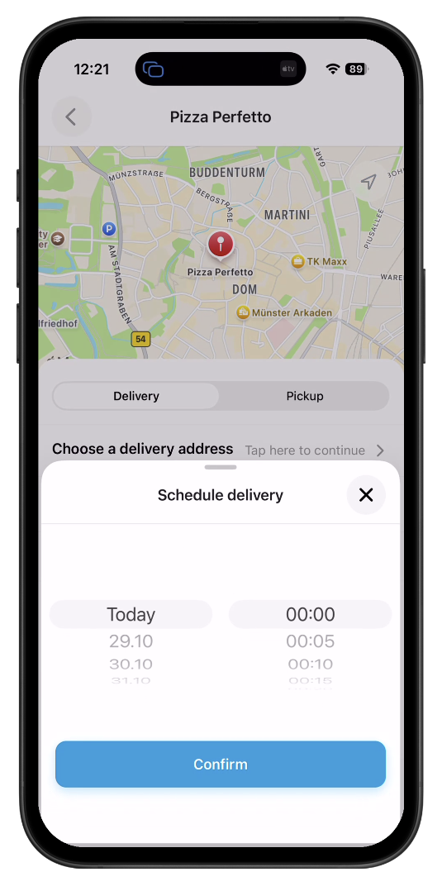
  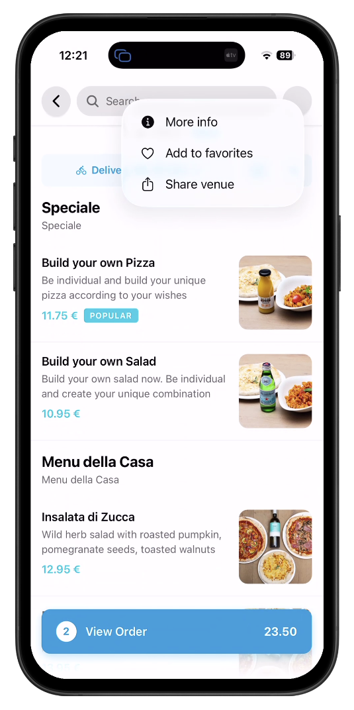
</div>

## ✨ Features

- 🏪 **Restaurant Discovery** - Browse through a curated list of restaurants with detailed information
- 📋 **Menu Browsing** - Explore restaurant menus with high-quality images and descriptions
- 🛒 **Shopping Cart** - Add items to cart, manage quantities, and view totals
- 🔐 **Authentication** - Sign in with Apple or Google for a seamless experience
- 🗺️ **Interactive Maps** - View restaurant locations on an interactive map
- 📍 **Location Services** - Get location-based restaurant recommendations
- 🎨 **Modern UI/UX** - Beautiful, intuitive interface with smooth animations
- 📱 **Cross-Platform** - Works on iOS, Android, and Web
- 💾 **Persistent Storage** - Cart and user data persist across app sessions
- ⚡ **Performance** - Optimized with React Query for efficient data fetching

## 🛠️ Tech Stack

- **Framework**: [Expo](https://expo.dev/) ~54.0.15
- **React Native**: 0.81.4
- **Navigation**: Expo Router (file-based routing)
- **State Management**: Zustand with persistent storage
- **Data Fetching**: TanStack React Query
- **Maps**: Expo Maps
- **Location**: Expo Location
- **Error Tracking**: Sentry
- **Language**: TypeScript
- **Styling**: React Native StyleSheet

## 📋 Prerequisites

Before you begin, ensure you have the following installed:

- [Node.js](https://nodejs.org/) (v18 or higher)
- [npm](https://www.npmjs.com/) or [yarn](https://yarnpkg.com/)
- [Expo CLI](https://docs.expo.dev/get-started/installation/)
- For iOS development: [Xcode](https://developer.apple.com/xcode/) (macOS only)
- For Android development: [Android Studio](https://developer.android.com/studio)

## 🚀 Getting Started

### 1. Clone the repository

```bash
git clone <repository-url>
cd wolt
```

### 2. Install dependencies

```bash
npm install
```

or

```bash
yarn install
```

### 3. Start the development server

```bash
npx expo start
```

### 4. Run on your preferred platform

In the Expo output, you'll find options to:

- **iOS Simulator**: Press `i` to open in iOS simulator
- **Android Emulator**: Press `a` to open in Android emulator
- **Physical Device**: Scan the QR code with Expo Go app
- **Web**: Press `w` to open in web browser

### Platform-specific commands

```bash
# Run on iOS
npm run ios

# Run on Android
npm run android

# Run on Web
npm run web
```

## 📁 Project Structure

```
wolt/
├── app/                    # Expo Router app directory (file-based routing)
│   ├── (app)/             # Main app routes
│   │   ├── (auth)/        # Authenticated routes
│   │   │   ├── (tabs)/    # Tab navigation
│   │   │   └── (modal)/   # Modal screens
│   │   └── (public)/      # Public routes
├── components/             # Reusable React components
│   ├── auth/              # Authentication components
│   ├── buttons/           # Button components
│   └── screens/           # Screen components
├── constants/             # App constants and theme
├── data/                  # Static data (restaurants, menus, etc.)
├── hooks/                 # Custom React hooks
├── services/              # API and service layer
├── utils/                 # Utility functions
├── assets/                # Images, fonts, and other assets
├── android/               # Android native code
└── ios/                   # iOS native code
```

## 🔧 Configuration

### Environment Setup

The app uses Expo's configuration system. Key settings are in `app.json`:

- **Bundle Identifier**: `com.supersimon.wolt`
- **App Name**: Wolt
- **Version**: 1.0.0

### Sentry Configuration

Error tracking is configured via Sentry. Update the Sentry configuration in `app.json` if needed.

## 📱 Features in Detail

### Restaurant Listing

- Browse restaurants with images, descriptions, and metadata
- View delivery fees and pricing information
- Filter and search functionality

### Menu System

- Detailed menu items with images
- Category-based organization
- Price and description for each item

### Shopping Cart

- Add/remove items
- Adjust quantities
- Real-time total calculation
- Persistent cart across sessions

### Authentication

- Apple Sign In
- Google Sign In
- Secure user session management

### Maps Integration

- Interactive map view
- Restaurant location markers
- Location-based services

## 🧪 Development

### Linting

```bash
npm run lint
```

### Type Checking

TypeScript is configured for type checking. The project uses strict TypeScript settings.

## 📦 Building for Production

### iOS

```bash
eas build --platform ios
```

### Android

```bash
eas build --platform android
```

Note: You'll need to set up [EAS Build](https://docs.expo.dev/build/introduction/) for production builds.

## 📄 License

This project is private and proprietary.

## 🙏 Acknowledgments

- Built with [Expo](https://expo.dev/)
- UI components inspired by modern food delivery apps
- Icons from [Expo Vector Icons](https://docs.expo.dev/guides/icons/)

---
